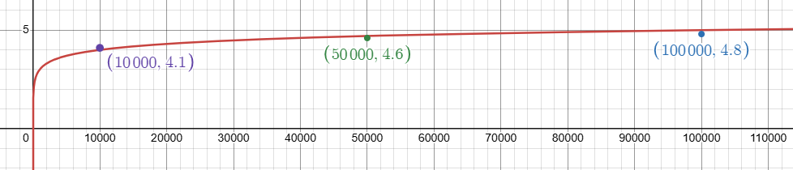

# Sample Writeup Formatting

## Section 1: Introduction

This has a sample of how to write different kinds of content in markdown formatting.

You can find a Youtube video introduction to how to work with markdown in VSCode here: [VSCode Markdown Editing](https://youtu.be/fq3_YX7m7dU).

If viewing in github, to see the source code, make sure you are looking at the Readme file and not the rendered copy at the root of the repository.

https://github.com/ChemeketaCS/markdown-sample/blob/main/Readme.md

Then switch from `Preview` view to `Code` view.

> [!TIP]
> In VS Code, you can use the command **Markdown: Open Preview to the Side** to see the rendered markdown as you write it.

> [!IMPORTANT]
> Some content, like this tip and important note will not appear in the markdown preview. They will only render properly on Github. So if you want to see how they will look, you can push your changes to Github and view the file there.

## Section 2: Basic Formatting

This is NOT an exhaustive list of markdown formatting. See [markdownguide.org](https://www.markdownguide.org/basic-syntax/) or
[Github's markdown documentation](https://docs.github.com/en/get-started/writing-on-github/getting-started-with-writing-and-formatting-on-github/basic-writing-and-formatting-syntax) for that.

Use this document's source code and that link as a reference when you need to figure out how to format some text. Below are some specific examples of more complex things you will need to do such as:

* Make a list (ordered or unordered)
* Make a table
* Make a code block (with syntax highlighting)
* Write inline code
* Write math that will render properly (using LaTeX syntax)

Note that single line breaks are usually ignored in markdown. To make a line break, you can end a line with two spaces and then hit enter. For example:

This is the first line.
This is the second line. But it will render in the same line as the first line because markdown ignores single line breaks.

This ends with two spaces.  
This is a different line. It will render separately from the first line because of the two spaces at the end of the first line.

## Section 3: Code Formatting

To indicate code inline within text, use backticks (\`). For example, \`print("Hello, World!")\` will render as `print("Hello, World!")`.

To write a code block, use triple backticks (\`\`\`) before and after the code. Here is some pseudocode for the infamous Bogosort algorithm:

```
Bogosort(arr):
    while not is_sorted(arr):
        shuffle(arr)
```


You can also specify the language for syntax highlighting. For example:

```cpp
#include <iostream>

int main() {
    std::cout << "Hello, World!" << std::endl;
    return 0;
}
```


## Section 4: Tables

To make a table, use pipes (|) to separate columns and dashes (-) to separate the header from the body. For example:

| Input Size | Time |
|---|---|
| 10  | 0.0012   |
| 100    | 0.0123   |
| 1000    | 0.1234   |

Note that the columns do not have to line up in your source code. You can align text to the left, right, or center by using colons (:) in the header separator. For example:

| Left align | Center align | Right align |
|:---|:---:|---:|
| 1  | 1   | 123   |
| 12    | 12   | 123   |
| 123    | 123   | 123   |


## Section 5: Math Formatting

You can write math using LaTeX syntax. For inline math, wrap the LaTeX code in single dollar signs ($). For example, \$E=mc^2\$ will render as $E=mc^2$.


For a full line of math, wrap the LaTeX code in double dollar signs ($$). For example:
$$O(n + 3) \cdot O(n) = O(n^2 + 3n) = O(n^2)$$

Here are some basic samples you might find handy:

* $O(\log n)$
* $O(n)$
* $O(n \cdot \log n)$ or $O(n \log n)$
* $O(n^2)$
* $n^{100}$
* $\log_2 n$
* $\log_{10} n$
* $\frac{n^2}{n} = n$

And a link to a more comprehensive list of LaTeX math symbols: [LaTeX Math cheat sheet](https://tug.ctan.org/info/undergradmath/undergradmath.pdf)


## Section 6: Images

If you want to include an image, you can use the following syntax:

```

```

For example:


